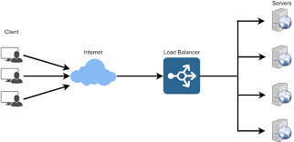

# Load Balancer implementation 

A load balancer is a piece of hardware (or virtual hardware) that acts like a reverse proxy to distribute network and/or application traffic across different servers.
A load balancer is used to improve the concurrent user capacity and overall reliability of applications.
A load balancer helps to improve these by distributing the workload across multiple servers, decreasing the overall burden placed on each server.

Diagram that explains the design in the project

